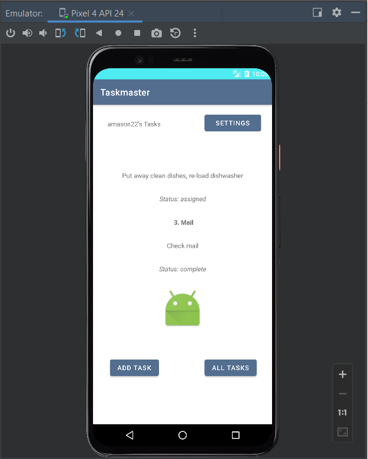

# Taskmaster

## Lab 26 9/19/22

### Features

Create a new app with three pages

**Main Activity**

Contains a plain text heading, an image, a button which redirects to the Add Task activity, and a button which redirects to the All Tasks activity
    
**Add Task**

Contains a plain text heading, an input for the task's title, an input for the task's description/body, and a submit button which, when clicked, renders a 'submitted' message.
  
**All Tasks**

Contains a plan text heading, an image, and a back button which redirects to the Main Activity view.

### Screenshots

## Lab 27 9/20/22

### Features

**Task Detail Page**

Create a Task Detail page. It should have a title at the top of the page, and a Lorem Ipsum description.

**Settings Page**

Create a Settings page. It should allow users to enter their username and hit save.

**Home Page (Main Activity)**

The main page contains three different buttons with hardcoded task titles. When a user taps one of the titles, it goes to the Task Detail page, and the title at the top of the page match the task title that was tapped on the previous page.

The home page also contains a button to visit the Settings page, and once the user has entered their username, it displays “{username}’s tasks” above the three task buttons.

### Screenshots

## Lab 28 9/21/22

### Features

**Task Class**

Task class contains a name, body, and a state ("new", "assigned", "in progress" or "complete).

**Home Page**

Refactored home page to use a RecyclerView for displaying Task data. Data is hardcoded.
Created TaskListRecycleViewAdapter that displays data from the hardcoded list of tasks.
When a task is tapped from the RecyclerView display, the Task Detail page is launched, with the name of the task displayed.

### Screenshots

## Lab 29 9/22/22

### Features

**Task Model and Room**

Room set up in application. Task class is annotated as an entity.

**Add Task Page**

Accepts data from the form and populates to the database

**Home Page**

Recycler View displays all tasks with title, body, and state from database. (updated 9/26/22)

**Task Detail Page**

Renders the name, body, and state of a task that is added from the Add Task Page (updated 9/26/22)

### Screenshots

## Lab 31 9/26/22

### Features

Added Espresso testing to verify the following:
- Existence of elements on the Main Activity (home) page
- Existence of elements on the Add Details page
- The user can add a task, which is then rendered in the Recycler View on the home page

**Tried unsuccessfully to test username rendering to homepage after modifying on the settings page. Feature works properly, but testing was out-of-sync. May be due to timing issues**

## Lab 32 9/27/22

### Features

- Removed Rooms implementation.
- Initialized AWS Amplify
- Data is populating from the AWS database to the app. 
  - Home page Recycler View shows saved tasks.
  - Task Detail page shows a task from the Recycler View when it is tapped.

### Screenshots

### Attributions

Alex White - demo code
Ben Mills & Raul Zarate - help with debugging
Stanley Wilder - collaboration
